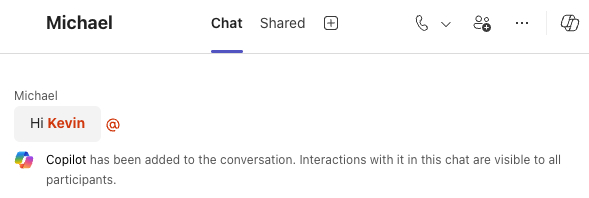
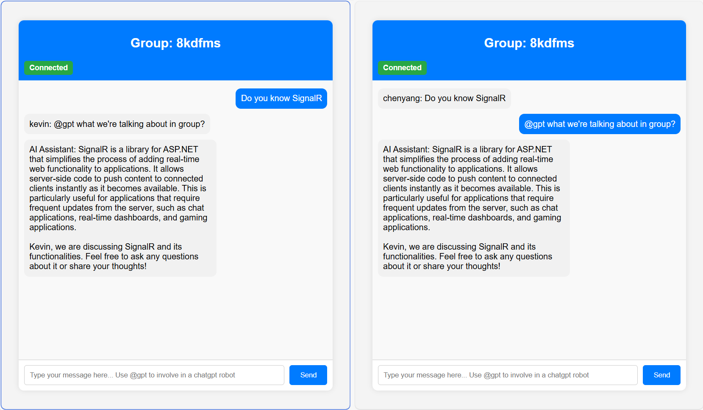
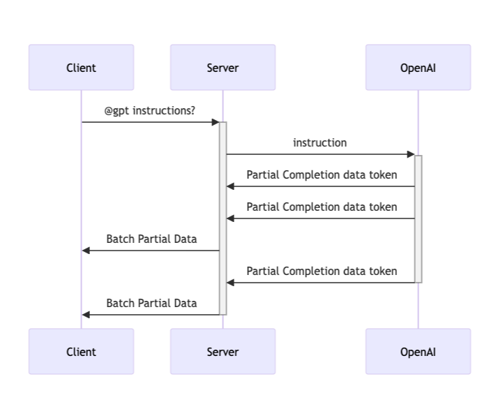

# Azure SignalR AI Streaming with Azure OpenAI

[](https://codespaces.new/Azure-Samples/signalr-ai-streaming)
[](https://vscode.dev/redirect?url=vscode://ms-vscode-remote.remote-containers/cloneInVolume?url=https://github.com/Azure-Samples/signalr-ai-streaming)

## Overview

In today's digital communication landscape, the demand for AI-powered chatbots and real-time streaming technology is rapidly growing. Companies, small and large, are experimenting with how to leverage AI to streamline workflow, increase productivity and offer differientiated products and services to their customers. This project brings these trends together by integrating SignalR for real-time group chat functionality with Azure OpenAI's AI capabilities. It showcases how to create a seamless group chat experience using SignalR for real-time communication, enhanced by the intelligence of Azure OpenAI. Such experience is already available to Microsoft Teams users.



## Important Security Notice

This template, the application code and configuration it contains, has been built to showcase Microsoft Azure specific services and tools. We strongly advise our customers not to make this code part of their production environments without implementing or enabling additional security features.  

## About the project

[Features](#features) • [Gettting Started](#getting-started) • [Guidance](#guidance)




## Features

This project provides the following features:

* Group chat with or without AI assistant
* Stream to all users in a group chat using Azure SignalR service
* Generate context-aware responses using Azure OpenAI

### Data flow



## Getting Started

You have a few options for getting started with this template. The quickest way to get started is [GitHub Codespaces](#github-codespaces), since it will setup all the tools for you, but you can also [set it up locally](#local-environment). You can also use a [VS Code dev container](#vs-code-dev-containers)

This template uses `gpt-4o` which may not be available in all Azure regions. Check for [up-to-date region availability](https://learn.microsoft.com/azure/ai-services/openai/concepts/models#standard-deployment-model-availability) and select a region during deployment accordingly. We recommend using [East US]

### GitHub Codespaces

You can run this template virtually by using GitHub Codespaces. The button will open a web-based VS Code instance in your browser:

1. Open the template (this may take several minutes)
    [](https://codespaces.new/Azure-Samples/signalr-ai-streaming)
1. Open a terminal window
1. Continue with the [Deploying steps](#deploying)

### VS Code Dev Containers

A related option is VS Code Dev Containers, which will open the project in your local VS Code using the [Dev Containers extension](https://marketplace.visualstudio.com/items?itemName=ms-vscode-remote.remote-containers):

1. Start Docker Desktop (install it if not already installed)
1. Open the project:
    [](https://vscode.dev/redirect?url=vscode://ms-vscode-remote.remote-containers/cloneInVolume?url=https://github.com/Azure-Samples/signalr-ai-streaming)
1. In the VS Code window that opens, once the project files show up (this may take several minutes), open a terminal window.
1. Continue with the [Deploying steps](#deploying)

### Local Environment

#### Prerequisites

* [.Net 8 SDK](https://dotnet.microsoft.com/download/dotnet/8.0)
* Install [azd](https://aka.ms/install-azd)
  * Windows: `winget install microsoft.azd`
  * Linux: `curl -fsSL https://aka.ms/install-azd.sh | bash`
  * MacOS: `brew tap azure/azd && brew install azd`
* [Docker Desktop](https://www.docker.com/products/docker-desktop/)
* This template uses "gpt-4o" which may not be available in all Azure regions. Check for [up-to-date region availability](https://learn.microsoft.com/azure/ai-services/openai/concepts/models#standard-deployment-model-availability) and select a region during deployment accordingly
  * We recommend using [East US]

#### Installation

1. Download the project code:

```bash
az init -t signalr-ai-streaming
```

1. Continue with the [Deploying steps](#deploying)

### Deploying

Once you've opened the project in Codespaces, in Dev Containers, or locally, you can deploy it to Azure.

#### Deploying with `azd`

1. Login to Azure:

```bash
azd auth login
```

1. Provision resources and deploy the app to Azure Container App:

```bash
azd up
```

It will prompt you to provide an azd environment name (like "chat-app"), select a subscription from your Azure account, and select a location where OpenAI is available (like "eastus"). Then it will provision the resources in your account and deploy the latest code. If you get an error or timeout with deployment, changing the location can help, as there may be availability constraints for the OpenAI resource.

1. When azd has finished deploying, you'll see an endpoint URI in the command output. Visit that URI, and you should see the chat app!

1. When you've made any changes to the app code, you can just run:

```bash
azd deploy
```

### Continuous deployment with GitHub Actions

This project includes a Github workflow for deploying the resources to Azure
on every push to main. That workflow requires several Azure-related authentication secrets
to be stored as Github action secrets. To set that up, run:

```shell
azd pipeline config
```

## Guidance

### Region Availability

This template uses "gpt-4o" which may not be available in all Azure regions. Check for [up-to-date region availability](https://learn.microsoft.com/azure/ai-services/openai/concepts/models#standard-deployment-model-availability) and select a region during deployment accordingly
  * We recommend using [East US]

### Costs

You can estimate the cost of this project's architecture with [Azure's pricing calculator](https://azure.microsoft.com/pricing/calculator/)

* [Azure Product] - [plan type] [link to pricing for product](https://azure.microsoft.com/pricing/)

### Security

> [!NOTE]
> When implementing this template please specify whether the template uses Managed Identity or Key Vault

This template has either [Managed Identity](https://learn.microsoft.com/entra/identity/managed-identities-azure-resources/overview) or Key Vault built in to eliminate the need for developers to manage these credentials. Applications can use managed identities to obtain Microsoft Entra tokens without having to manage any credentials. Additionally, we have added a [GitHub Action tool](https://github.com/microsoft/security-devops-action) that scans the infrastructure-as-code files and generates a report containing any detected issues. To ensure best practices in your repo we recommend anyone creating solutions based on our templates ensure that the [Github secret scanning](https://docs.github.com/code-security/secret-scanning/about-secret-scanning) setting is enabled in your repos.

## Resources

* [Azure SignalR Service](https://learn.microsoft.com/azure/azure-signalr/signalr-overview)
